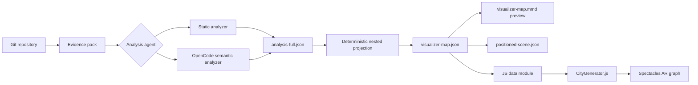

# TigerVerse 2026

TigerVerse 2026 is a Snapchat Lens Studio project for Spectacles that turns a software repository into an interactive 3D architecture map. The goal is to help developers understand unfamiliar codebases spatially: high-level systems appear first, then users can tap nodes to expand nested implementation detail.

The project has two main parts:

- `Spectacles/`: the Lens Studio experience that renders and manipulates the 3D graph on Spectacles.
- `tools/code_analyzer/`: an offline Python analyzer that converts a Git repository into visualizer artifacts the Lens can load.

## Idea

Traditional file trees and static dependency graphs are hard to use once a codebase becomes large. TigerVerse represents a repo as a table-top AR model where architectural areas, modules, and files can be explored in layers.

Primary use cases:

- Onboard onto an unfamiliar codebase faster.
- Review architecture at a system level before diving into files.
- Trace relationships between modules, data flow, UI surfaces, and backend services.

The longer-term vision is a collaborative AR engineering workspace where multiple people can inspect, discuss, and reshape system architecture together.

## Current Implementation

The current Lens is based on the Lens Studio Spectacles template and targets `lensClientCompatibilities: Spectacles` in `Spectacles/Spectacles.esproj`. It uses Lens Studio 5.15.4 project metadata and the Spectacles packages checked into `Spectacles/Packages/`.

The visualizer script is `Spectacles/Assets/Scripts/CityGenerator.js`. It:

- Loads generated graph data from `Spectacles/Assets/Scripts/Data/claude_vizualizer_data.js`.
- Accepts both the `spec.json`-style `tier` shape and the analyzer's `root_layer` shape.
- Spawns node prefabs and connection prefabs in 3D space.
- Places root nodes in a stable circular layout.
- Places child tiers above expanded parent nodes.
- Lets users tap a node to expand or collapse its children.
- Supports hold-to-drag behavior for repositioning expanded structures.
- Keeps connection lines updated as nodes move.

The analyzer creates richer artifacts first, then derives smaller renderable projections for Spectacles. This keeps the source analysis complete while making the Lens payload small enough to browse.

## Architecture



## Repository Layout

```text
.
├── Spectacles/                         # Lens Studio Spectacles project
│   ├── Spectacles.esproj               # Lens project metadata
│   ├── Packages/                       # SIK, Spectacles UI Kit, and support packages
│   └── Assets/
│       ├── Scene.scene                 # Main Lens Studio scene
│       ├── NodePrefab.prefab           # Visual graph node prefab
│       ├── ConnectionPrefab.prefab     # Visual graph edge prefab
│       └── Scripts/
│           ├── CityGenerator.js        # Runtime graph builder and interactions
│           └── Data/                   # Generated visualizer payload modules
├── tools/code_analyzer/                # Offline repository analyzer
├── tests/                              # Analyzer and layout tests
├── visualizer_layout_samples/          # Sample visualizer and positioned scene payloads
├── idea.md                             # Original product concept
├── DESIGN.md                           # Visual design direction
├── spec.json                           # Reference visualizer data contract
├── pyproject.toml                      # Python package and uv configuration
└── uv.lock
```

## Data Flow

The analyzer output bundle is organized as:

- `evidence/analysis-evidence.json`: deterministic repo facts, file tree, manifests, dependency hints, and source context.
- `analysis/analysis-full.json`: rich semantic architecture graph with evidence and source references.
- `visualizer/visualizer-map.json`: nested projection for the renderer and Lens data contract.
- `visualizer/visualizer-map.mmd`: Mermaid preview for quick human validation.
- `visualizer/positioned-scene.json`: deterministic scene payload with node coordinates and arrow endpoints.
- `manifest.json`: machine-readable index of the generated artifacts.

`visualizer-map.json` is designed to preserve the `spec.json` surface shape with top-level `edges` and recursive `tier` nodes. It may also include analyzer-specific metadata such as `schema_version`, `constraints`, `repo`, `root_layer`, node layout hints, and evidence summaries.

## Setup

Install Python tooling:

```bash
uv sync --extra dev
```

Optional UI dependencies:

```bash
uv sync --extra dev --extra ui
```

Open the Lens project:

1. Install Lens Studio 5.15.4 or newer.
2. Open `Spectacles/Spectacles.esproj`.
3. Confirm the `CityGenerator` scene object has `nodePrefab` and `connectionPrefab` assigned.
4. Preview in Lens Studio or pair Spectacles through Lens Studio's device workflow.

## Generate Visualizer Artifacts

Static analysis is deterministic and works well for tests, demos, and fallback output:

```bash
uv run code-analyzer analyze <git-url-or-local-repo> --out analyze-output --agent static
```

OpenCode semantic analysis can produce richer hierarchy when OpenCode is configured locally:

```bash
uv run code-analyzer analyze <git-url-or-local-repo> --out analyze-output --agent opencode --opencode-model opencode/big-pickle
```

Useful options:

```bash
uv run code-analyzer analyze <repo> --out analyze-output --target-user beginner --max-layer-depth 3 --max-nodes-per-layer 20
uv run code-analyzer render analyze-output/visualizer/visualizer-map.json --out analyze-output/visualizer/visualizer-map.mmd
uv run python -m code_analyzer.scene_layout analyze-output/visualizer/visualizer-map.json --out analyze-output/visualizer/positioned-scene.json
```

The analyzer prints timestamped progress to stderr. Remote clones are treated as disposable analyzer workspaces and cleaned up after analysis; direct local repo paths are preserved.

## Load Data Into the Lens

The current Lens script imports a JavaScript module:

```javascript
var visualizerData = require("./Data/claude_vizualizer_data");
```

For demo usage, generate `visualizer/visualizer-map.json`, then provide the same object as a Lens Studio-compatible JS module under `Spectacles/Assets/Scripts/Data/`. The checked-in `claude_vizualizer_data.js` and `VisualizerData.js` files show the expected `module.exports = { ... }` format.

The runtime supports nested data in this shape:

```json
{
  "edges": [],
  "tier": {
    "id": "tier_1",
    "nodes": [
      {
        "id": "system_frontend",
        "title": "Frontend",
        "description": "Client-facing system",
        "tier": null
      }
    ],
    "edges": null
  }
}
```

## Local Analyzer UI

Launch the Streamlit helper UI:

```bash
uv run --extra ui streamlit run tools/code_analyzer/src/code_analyzer/app.py
```

The UI builds the same `code-analyzer analyze` command, preserves prior run logs across reruns, and exposes advanced options such as workspace directory, Git ref, target user, layer depth, node caps, agent, and model.

## Testing

Run the Python test suite:

```bash
uv run pytest
```

Run whitespace checks before committing:

```bash
git diff --check
```

The tests cover the analyzer CLI, repository checkout cleanup, model-output parsing, validation, deterministic projection, Mermaid rendering, Streamlit command helpers, and scene layout export.

## Visual Direction

`DESIGN.md` captures the intended polished visual style: tactile, premium nodes with PBR materials, a restrained palette, thinner connection lines, and readable labels. The current `CityGenerator.js` already supports slab-like node scaling, stable child layouts, dynamic connection updates, and tap-through exploration; material and prefab styling can continue inside Lens Studio.

## Key Files

- `Spectacles/Assets/Scripts/CityGenerator.js`: Lens runtime graph construction and interaction logic.
- `Spectacles/Assets/Scripts/Data/claude_vizualizer_data.js`: current generated graph payload loaded by the Lens.
- `tools/code_analyzer/src/code_analyzer/cli.py`: analyzer CLI entry point.
- `tools/code_analyzer/src/code_analyzer/projection.py`: `analysis-full.json` to nested visualizer projection.
- `tools/code_analyzer/src/code_analyzer/scene_layout.py`: deterministic positioned scene export.
- `tools/code_analyzer/src/code_analyzer/agent.py`: OpenCode integration and model-output parsing.
- `spec.json`: reference contract for visualizer data consumed by the Lens.

<sub>Built with help from Cursor and Codex.</sub>
